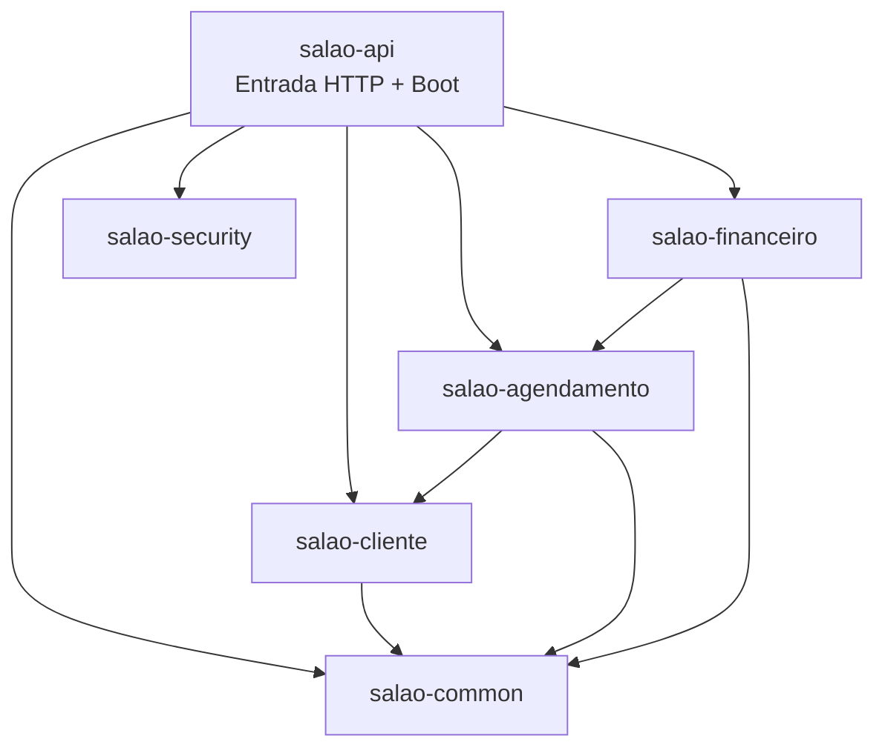
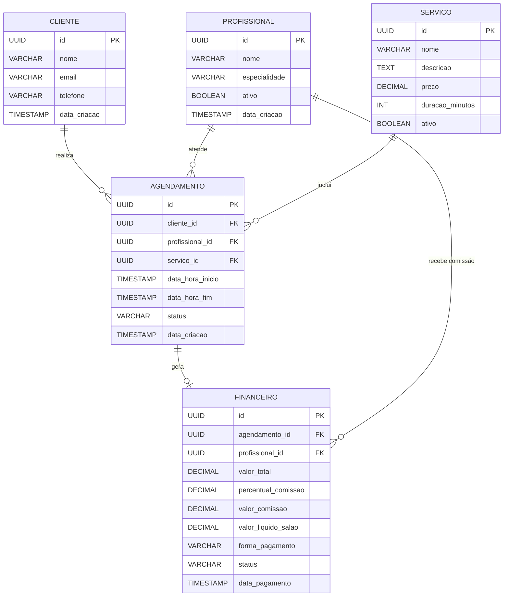
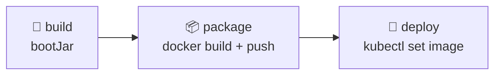

# API Salão de Beleza

> Sistema de gestão para salão de beleza com agendamento, cadastro de clientes, controle financeiro e emissão de relatórios.

---

## Sumário

1. [Visão Geral](#visão-geral)
2. [Stack de Tecnologias](#stack-de-tecnologias)
3. [Arquitetura e Módulos](#arquitetura-e-módulos)
4. [Modelo de Domínio](#modelo-de-domínio)
5. [Endpoints da API](#endpoints-da-api)
6. [Banco de Dados](#banco-de-dados)
7. [Segurança e Autenticação](#segurança-e-autenticação)
8. [Configuração da Aplicação](#configuração-da-aplicação)
9. [Deploy e Infraestrutura](#deploy-e-infraestrutura)
10. [CI/CD (GitLab)](#cicd-gitlab)
11. [Coleção Postman](#coleção-postman)
12. [Regras de Negócio](#regras-de-negócio)
13. [Estrutura de Arquivos](#estrutura-de-arquivos)

---

## Visão Geral

| Atributo       | Valor                        |
|----------------|------------------------------|
| **Nome**       | `salao-root`                 |
| **Versão**     | `1.0.0`                      |
| **Group ID**   | `com.salao`                  |
| **Framework**  | Spring Boot `3.3.4`          |
| **Java**       | Java 21                      |
| **Build**      | Gradle (multi-módulo)        |
| **Arquitetura**| Monólito Modular             |

A aplicação é um **monólito modular** — empacotada em um único JAR executável (`salao-api-1.0.0.jar`), porém organizada internamente em módulos Gradle com responsabilidades de domínio bem delimitadas. A entrada de todas as dependências e a camada HTTP ficam centralizadas no módulo `salao-api`.

---

## Stack de Tecnologias

### Framework & Core

| Biblioteca | Versão |
|---|---|
| Spring Boot | `3.3.4` |
| Spring Web | — |
| Spring Data JPA | — |
| Spring Security | — |
| Spring OAuth2 Resource Server | — |
| Spring Validation | — |

### Banco de Dados & Persistência

| Componente | Detalhe |
|---|---|
| Banco de dados | PostgreSQL |
| ORM | Hibernate (via Spring Data JPA) |
| Dialect | `org.hibernate.dialect.PostgreSQLDialect` |
| DDL | `validate` (gerenciado pelo Flyway) |
| Migrações | Flyway (`flyway-core` + `flyway-database-postgresql`) |
| Local das migrações | `classpath:db/migration` |

### Segurança

| Componente | Detalhe |
|---|---|
| Provedor OAuth2 | Keycloak |
| Realm | `salao-realm` |
| Keycloak URL | `http://192.168.18.200:8080` |
| JWT Issuer URI | `http://192.168.18.200:8080/realms/salao-realm` |
| Auth alternativa | Header `x-api-token` (token estático) |

### Documentação & Ferramentas

| Ferramenta | Detalhe |
|---|---|
| OpenAPI / Swagger | SpringDoc `2.5.0` |
| Swagger UI | `/swagger-ui/**` |
| OpenAPI JSON | `/v3/api-docs/**` |
| Lombok | `compileOnly` + `annotationProcessor` |
| Logging | SLF4J |

---

## Arquitetura e Módulos

### Grafo de dependências dos módulos



### Responsabilidade de cada módulo

| Módulo | Responsabilidade |
|---|---|
| `salao-common` | Código compartilhado e utilitários (sem classes ainda) |
| `salao-security` | Configuração de segurança, filtros JWT e API Token |
| `salao-cliente` | Cadastro e consulta de clientes |
| `salao-agendamento` | Agendamentos, profissionais, serviços e relatórios |
| `salao-financeiro` | Registro de pagamentos e cálculo de comissões |
| `salao-api` | Ponto de entrada: controllers, config OpenAPI, main class, Flyway |

---

## Modelo de Domínio

### Entidades

#### `Cliente`
Módulo: `salao-cliente` · Tabela: `cliente`

| Campo | Tipo | Restrição |
|---|---|---|
| `id` | `UUID` | PK, auto-gerado |
| `nome` | `String` | NOT NULL |
| `email` | `String` | NOT NULL, UNIQUE |
| `telefone` | `String` | — |
| `dataCriacao` | `LocalDateTime` | NOT NULL, preenchido via `@PrePersist` |

---

#### `Profissional`
Módulo: `salao-agendamento` · Tabela: `profissional`

| Campo | Tipo | Restrição |
|---|---|---|
| `id` | `UUID` | PK |
| `nome` | `String` | NOT NULL |
| `especialidade` | `String` | — |
| `ativo` | `boolean` | DEFAULT `true` |
| `dataCriacao` | `LocalDateTime` | NOT NULL, auto-set |

---

#### `Servico`
Módulo: `salao-agendamento` · Tabela: `servico`

| Campo | Tipo | Restrição |
|---|---|---|
| `id` | `UUID` | PK |
| `nome` | `String` | NOT NULL |
| `descricao` | `String` | — |
| `preco` | `BigDecimal` | NOT NULL |
| `duracaoMinutos` | `Integer` | NOT NULL |
| `ativo` | `boolean` | DEFAULT `true` |

---

#### `Agendamento`
Módulo: `salao-agendamento` · Tabela: `agendamento`

| Campo | Tipo | Restrição |
|---|---|---|
| `id` | `UUID` | PK |
| `cliente` | `Cliente` | FK `cliente_id`, LAZY |
| `profissional` | `Profissional` | FK `profissional_id`, LAZY |
| `servico` | `Servico` | FK `servico_id`, LAZY |
| `dataHoraInicio` | `LocalDateTime` | NOT NULL |
| `dataHoraFim` | `LocalDateTime` | NOT NULL (calculado) |
| `status` | `String` | NOT NULL, DEFAULT `"PENDENTE"` |
| `dataCriacao` | `LocalDateTime` | NOT NULL, auto-set |

---

#### `Financeiro`
Módulo: `salao-financeiro` · Tabela: `financeiro`

| Campo | Tipo | Restrição |
|---|---|---|
| `id` | `UUID` | PK |
| `agendamento` | `Agendamento` | FK `agendamento_id`, LAZY |
| `profissional` | `Profissional` | FK `profissional_id`, LAZY |
| `valorTotal` | `BigDecimal` | — |
| `percentualComissao` | `BigDecimal` | — |
| `valorComissao` | `BigDecimal` | — |
| `valorLiquidoSalao` | `BigDecimal` | — |
| `formaPagamento` | `String` | Ex.: `PIX`, `DINHEIRO`, `CARTAO` |
| `status` | `String` | DEFAULT `"PAGO"` via `@PrePersist` |
| `dataPagamento` | `LocalDateTime` | NOT NULL, auto-set |

---

### Diagrama ER



---

## Endpoints da API

> **Base URL:** `http://localhost:8080`  
> Todos os endpoints exigem a authority `SCOPE_agendamento:escrever` — via **JWT Keycloak** ou header **`x-api-token`**.

### Clientes — `/api/clientes`

| Método | Path | Descrição | Body / Params |
|---|---|---|---|
| `POST` | `/api/clientes` | Cadastrar novo cliente | Body JSON: `{ nome, email, telefone }` |
| `GET` | `/api/clientes` | Listar todos os clientes | — |
| `GET` | `/api/clientes/{id}` | Buscar cliente por UUID | Path: `id` |

---

### Agendamentos — `/api/agendamentos`

| Método | Path | Descrição | Body / Params |
|---|---|---|---|
| `POST` | `/api/agendamentos` | Criar novo agendamento | Query: `clienteId`, `profissionalId`, `servicoId`, `dataHoraInicio` |
| `GET` | `/api/agendamentos` | Listar todos os agendamentos | — |

---

### Catálogo — `/api/catalogo`

| Método | Path | Descrição |
|---|---|---|
| `GET` | `/api/catalogo/profissionais` | Listar profissionais |
| `GET` | `/api/catalogo/servicos` | Listar serviços disponíveis |

---

### Financeiro — `/api/financeiro`

| Método | Path | Descrição | Query Params |
|---|---|---|---|
| `POST` | `/api/financeiro` | Registrar pagamento e calcular comissão | `agendamentoId`, `percentualComissao`, `formaPagamento` |

---

### Relatórios — `/api/relatorios/agendamentos`

| Método | Path | Descrição | Query Params |
|---|---|---|---|
| `GET` | `/api/relatorios/agendamentos` | Relatório de agendamentos por período | `inicio`, `fim` (ISO DateTime) |

---

### Endpoints Públicos (sem autenticação)

| Path | Descrição |
|---|---|
| `/swagger-ui/**` | Swagger UI interativo |
| `/v3/api-docs/**` | Especificação OpenAPI em JSON |

---

## Banco de Dados

As migrações são gerenciadas pelo **Flyway** e ficam em `salao-api/src/main/resources/db/migration/`.

### V1 — Tabela `cliente`

```sql
CREATE TABLE cliente (
    id UUID PRIMARY KEY,
    nome VARCHAR(255) NOT NULL,
    email VARCHAR(255) UNIQUE NOT NULL,
    telefone VARCHAR(50),
    data_criacao TIMESTAMP NOT NULL
);
```

### V2 — Módulo de Agendamentos

```sql
CREATE TABLE profissional (
   id UUID PRIMARY KEY,
   nome VARCHAR(255) NOT NULL,
   especialidade VARCHAR(255),
   ativo BOOLEAN NOT NULL DEFAULT TRUE,
   data_criacao TIMESTAMP NOT NULL
);

CREATE TABLE servico (
   id UUID PRIMARY KEY,
   nome VARCHAR(255) NOT NULL,
   descricao TEXT,
   preco DECIMAL(10, 2) NOT NULL,
   duracao_minutos INT NOT NULL,
   ativo BOOLEAN NOT NULL DEFAULT TRUE
);

CREATE TABLE agendamento (
   id UUID PRIMARY KEY,
   cliente_id UUID NOT NULL,
   profissional_id UUID NOT NULL,
   servico_id UUID NOT NULL,
   data_hora_inicio TIMESTAMP NOT NULL,
   data_hora_fim TIMESTAMP NOT NULL,
   status VARCHAR(50) NOT NULL,
   data_criacao TIMESTAMP NOT NULL,
   CONSTRAINT fk_agendamento_cliente FOREIGN KEY (cliente_id) REFERENCES cliente(id),
   CONSTRAINT fk_agendamento_profissional FOREIGN KEY (profissional_id) REFERENCES profissional(id),
   CONSTRAINT fk_agendamento_servico FOREIGN KEY (servico_id) REFERENCES servico(id)
);
```

### V3 — Módulo Financeiro

```sql
CREATE TABLE financeiro (
   id UUID PRIMARY KEY,
   agendamento_id UUID NOT NULL,
   profissional_id UUID NOT NULL,
   valor_total DECIMAL(10, 2) NOT NULL,
   percentual_comissao DECIMAL(5, 2) NOT NULL,
   valor_comissao DECIMAL(10, 2) NOT NULL,
   valor_liquido_salao DECIMAL(10, 2) NOT NULL,
   forma_pagamento VARCHAR(50) NOT NULL,
   status VARCHAR(50) NOT NULL,
   data_pagamento TIMESTAMP NOT NULL,
   CONSTRAINT fk_financeiro_agendamento FOREIGN KEY (agendamento_id) REFERENCES agendamento(id),
   CONSTRAINT fk_financeiro_profissional FOREIGN KEY (profissional_id) REFERENCES profissional(id)
);
```

---

## Segurança e Autenticação

A aplicação suporta **dois mecanismos de autenticação** em paralelo:

### 1. OAuth2 JWT via Keycloak (mecanismo principal)

- Spring Security configurado como **OAuth2 Resource Server**
- Tokens JWT validados contra o JWKS do Keycloak
- Autorização granular via authority `SCOPE_agendamento:escrever`
- Anotação usada nos controllers: `@PreAuthorize("hasAuthority('SCOPE_agendamento:escrever')")`

**Configuração Keycloak:**

| Parâmetro | Valor |
|---|---|
| Realm | `salao-realm` |
| Issuer URI | `http://192.168.18.200:8080/realms/salao-realm` |
| JWK Set URI | `http://192.168.18.200:8080/realms/salao-realm/protocol/openid-connect/certs` |
| Auth URL | `.../protocol/openid-connect/auth` |
| Token URL | `.../protocol/openid-connect/token` |
| Scope necessário | `agendamento:escrever` |

---

### 2. API Token via header `x-api-token` (mecanismo alternativo)

- Implementado via filtro customizado `ApiTokenAuthenticationFilter` (`OncePerRequestFilter`)
- Executado **antes** do `UsernamePasswordAuthenticationFilter`
- Token estático (desenvolvimento/testes): `salao-secret-api-token-123`
- Em caso de token válido: injeta principal `"ApiTokenUser"` com authority `SCOPE_agendamento:escrever`
- Em caso de token inválido: retorna **HTTP 401**

> [!WARNING]
> O token estático `salao-secret-api-token-123` é apenas para desenvolvimento/testes. Em produção, o comentário no código indica que a validação deve consultar cache ou banco de dados.

---

### Fluxo da cadeia de segurança

```
Requisição HTTP
    │
    ▼
ApiTokenAuthenticationFilter
    ├── Header x-api-token presente?
    │       ├── SIM e válido  →  injeta auth "ApiTokenUser" → continua
    │       └── SIM e inválido →  HTTP 401
    └── NÃO → passa adiante
    │
    ▼
OAuth2 Resource Server (JWT Keycloak)
    │
    ▼
@PreAuthorize("hasAuthority('SCOPE_agendamento:escrever')")
```

---

## Configuração da Aplicação

Arquivo: `salao-api/src/main/resources/application.yml`

```yaml
spring:
  application:
    name: salao-api
  datasource:
    url: ${DB_URL:jdbc:postgresql://localhost:5432/salao_db}
    username: ${DB_USER:admin}
    password: ${DB_PASSWORD:admin}
  jpa:
    hibernate:
      ddl-auto: validate
    show-sql: true
    properties:
      hibernate:
        dialect: org.hibernate.dialect.PostgreSQLDialect
  flyway:
    enabled: true
    locations: classpath:db/migration
  security:
    oauth2:
      resourceserver:
        jwt:
          issuer-uri: http://192.168.18.200:8080/realms/salao-realm
          jwk-set-uri: http://192.168.18.200:8080/realms/salao-realm/protocol/openid-connect/certs
```

### Variáveis de ambiente configuráveis

| Variável | Padrão | Descrição |
|---|---|---|
| `DB_URL` | `jdbc:postgresql://localhost:5432/salao_db` | URL do banco PostgreSQL |
| `DB_USER` | `admin` | Usuário do banco |
| `DB_PASSWORD` | `admin` | Senha do banco |

---

## Deploy e Infraestrutura

### Docker

**Dockerfile:**
```dockerfile
FROM eclipse-temurin:21-jre-alpine
WORKDIR /app
COPY salao-api/build/libs/salao-api-1.0.0.jar app.jar
EXPOSE 8080
ENTRYPOINT ["java", "-jar", "app.jar"]
```

- Imagem base: `eclipse-temurin:21-jre-alpine` (JRE leve)
- Artefato: `salao-api/build/libs/salao-api-1.0.0.jar`
- Porta exposta: `8080`

**Build do JAR:**
```bash
./gradlew :salao-api:bootJar
```

**Build da imagem Docker:**
```bash
docker build -t seu-registry/salao-api:1.0.0 .
```

---

### Kubernetes

Arquivo: `k8s-deployment.yaml`

**Deployment:**

| Parâmetro | Valor |
|---|---|
| Nome | `salao-api` |
| Namespace | `default` |
| Réplicas | `1` |
| Imagem | `seu-registry/salao-api:1.0.0` |
| Pull Policy | `IfNotPresent` |
| Porta | `8080` |

**Variáveis de ambiente injetadas no pod:**

| Variável | Valor |
|---|---|
| `SPRING_PROFILES_ACTIVE` | `prod` |
| `SPRING_SECURITY_OAUTH2_RESOURCESERVER_JWT_ISSUER_URI` | `http://192.168.18.200:8080/realms/salao-realm` |
| `SPRING_DATASOURCE_URL` | `jdbc:postgresql://postgres-service:5432/salao_db` |

**Service:**

| Parâmetro | Valor |
|---|---|
| Nome | `salao-api-service` |
| Tipo | `ClusterIP` |
| Porta externa | `80` |
| Porta container | `8080` |

---

## CI/CD (GitLab)

Arquivo: `.gitlab-ci.yml` — pipeline com três estágios:



| Estágio | Imagem | Comando Principal |
|---|---|---|
| `build` | `eclipse-temurin:21-jdk-alpine` | `./gradlew :salao-api:bootJar` |
| `package` | Docker-in-Docker | `docker build` + `docker push seu-registry/salao-api:1.0.0` |
| `deploy` | kubectl | `kubectl set image deployment/salao-api ...` + `kubectl rollout status` |

---

## Coleção Postman

Pasta: `postman/`  
Collection: **"API Salão de Beleza - Modular"**

### Variáveis de ambiente (`postman/env.json`)

| Variável | Valor padrão |
|---|---|
| `keycloak_url` | `http://192.168.18.200:8080` |
| `realm` | `salao-realm` |
| `api_url` | `http://localhost:8080` |
| `bearer_token` | *(preenchido automaticamente pelo script de teste)* |
| `api_token` | `salao-secret-api-token-123` |

### Requisições incluídas

#### Autenticação Keycloak
- **Obter Token OAuth2 (Password Grant)**  
  `POST {{keycloak_url}}/realms/{{realm}}/protocol/openid-connect/token`  
  Body (form-urlencoded): `grant_type=password`, `client_id`, `username`, `password`, `scope=agendamento:escrever`  
  > O script de teste salva automaticamente o `access_token` na variável `bearer_token`.

#### Agendamentos
- **Criar Agendamento (Keycloak)** — `POST /api/agendamentos` com `Authorization: Bearer {{bearer_token}}`
- **Criar Agendamento (API Token)** — `POST /api/agendamentos` com `x-api-token: {{api_token}}`

---

## Regras de Negócio

### 1. Verificação de conflito de horário
Ao criar um agendamento, o sistema verifica se o profissional já possui um agendamento com status diferente de `CANCELADO` que se sobreponha ao período solicitado. Se houver conflito, lança `IllegalStateException`.

### 2. Cálculo automático do horário de fim
```
dataHoraFim = dataHoraInicio + servico.duracaoMinutos
```

### 3. Unicidade de e-mail do cliente
Ao cadastrar um cliente, o sistema verifica se o e-mail já está cadastrado. Se estiver, lança `IllegalArgumentException`.

### 4. Cálculo de comissão financeira
$$\text{valorComissao} = \text{valorTotal} \times \frac{\text{percentualComissao}}{100}$$

$$\text{valorLiquidoSalao} = \text{valorTotal} - \text{valorComissao}$$

### 5. Status padrão
- Agendamentos criados com status `PENDENTE`
- Registros financeiros criados com status `PAGO`

### 6. Padrão CQRS-lite para relatórios
O `AgendamentoQueryService` utiliza `EntityManager` com JPQL diretamente para leituras otimizadas de relatórios, separando a responsabilidade de leitura dos serviços de escrita (`AgendamentoService`).

---

## Estrutura de Arquivos

```
salao/
├── .gitlab-ci.yml                           # Pipeline GitLab CI/CD
├── .gitignore
├── Dockerfile                               # Build da imagem Docker
├── README.md                                # (legado — referência ao Micronaut)
├── build.gradle                             # Configuração raiz do Gradle
├── settings.gradle                          # Declaração dos módulos
├── gradlew / gradlew.bat                    # Gradle Wrapper
├── k8s-deployment.yaml                      # Deploy e Service Kubernetes
│
├── postman/
│   ├── collection.json                      # Coleção Postman
│   └── env.json                             # Ambiente local Postman
│
├── salao-common/
│   └── build.gradle                         # Sem código ainda
│
├── salao-security/
│   ├── build.gradle
│   └── src/main/java/com/salao/security/
│       ├── config/SecurityConfig.java       # Configuração Spring Security + OAuth2
│       └── filter/ApiTokenAuthenticationFilter.java  # Filtro x-api-token
│
├── salao-cliente/
│   ├── build.gradle
│   └── src/main/java/com/salao/cliente/
│       ├── model/Cliente.java
│       ├── repository/ClienteRepository.java
│       └── service/ClienteService.java
│
├── salao-agendamento/
│   ├── build.gradle
│   └── src/main/java/com/salao/agendamento/
│       ├── model/
│       │   ├── Agendamento.java
│       │   ├── Profissional.java
│       │   └── Servico.java
│       ├── repository/
│       │   ├── AgendamentoRepository.java   # JPQL p/ conflito de horário
│       │   ├── ProfissionalRepository.java
│       │   └── ServicoRepository.java
│       ├── service/
│       │   └── AgendamentoService.java      # Lógica de criação + conflito
│       └── query/
│           ├── AgendamentoQueryService.java  # CQRS-lite via EntityManager
│           └── dto/RelatorioAgendamentoDTO.java
│
├── salao-financeiro/
│   ├── build.gradle
│   └── src/main/java/com/salao/financeiro/
│       ├── model/Financeiro.java
│       ├── repository/FinanceiroRepository.java
│       └── service/FinanceiroService.java   # Registro de pagamento + comissão
│
└── salao-api/
    ├── build.gradle                         # Módulo principal (bootJar)
    └── src/main/
        ├── java/com/salao/api/
        │   ├── Application.java             # @SpringBootApplication + @ComponentScan
        │   ├── config/OpenApiConfig.java    # Swagger / OpenAPI 3
        │   └── controller/
        │       ├── AgendamentoController.java
        │       ├── ClienteController.java
        │       ├── FinanceiroController.java
        │       ├── ProfissionalServicoController.java
        │       └── RelatorioAgendamentoController.java
        └── resources/
            ├── application.yml
            └── db/migration/
                ├── V1__create_table_cliente.sql
                ├── V2__create_agendamento_modules.sql
                └── V3__create_financeiro_module.sql
```

---


> [!TIP]
> O módulo `salao-common` existe na configuração do Gradle (`settings.gradle`) mas ainda não possui código-fonte. É o local previsto para futuras classes e utilitários compartilhados entre módulos.
